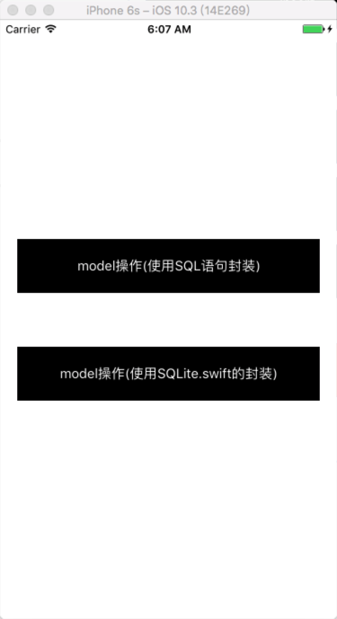

# AutoSQLite.swift
SQLite.swift的封装，使用swift的反射原理，Model直接存储.获取. 无需再转换,增删改查. 脱离sql语句,不需要添加相关的绑定操作，直接完成转换。

[](https://github.com/TonyReet/TYSnapshotScroll)   [](https://github.com/TonyReet/TYSnapshotScroll)



### 使用方法
* 1. 导入   

>A. Pod导入

```
  pod 'AutoSQLiteSwift'
```

>B. 引入source目录下的文件文件:

```
SQLiteModel.swift
SQLiteDataBase.swift
SQLiteDataBaseTool.swift
SQLMirrorModel.swift
SQLPropertyModel.swift

创建model继承SQLiteModel即可
```

- 2. 使用以下方法

```
        // 创建dataBase,
        var manager = SQLiteDataBase.createDB("testDataBaseName")
```

```
        // 插入
        manager.insert(object: testModel, intoTable: "testTableName")
        
        或者
        
        SQLiteDataBase.insert(object: testModel, intoTable: "testTableName")
```

```     
        // 删除
        manager.delete(testModel, fromTable: "testTableName")
        
        或者
        
        SQLiteDataBase.deleteModel(testModel, fromTable: "testTableName")
        
```

```
        // 更新
        testModel.name = "Reet"

        manager.update(testModel, fromTable: "testTableName")
        
        或者
        
        SQLiteDataBase.update(testModel, fromTable: "testTableName")
```

```
        // 查询
        guard let results = manager.select(testModel, fromTable: "testTableName") else {
            print("没有查询到数据")
            return
        }

        for result in results {
            print("查询的数据\(result)")
        }
        
        或者
        
        let results = SQLiteDataBase.select(testModel, fromTable: "testTableName")

        if results.count > 0{
            for result in results {
                print("查询的数据\(result)")
            }
        }else {
            print("没有查询到数据")
        }

```


## upgrade
####19.7.30    
新增可选类型(optional)
####19.4.23    
新增字段时，直接在表里面添加，避免报错


有任何疑问或建议. 欢迎在github或微博里issue我. 
微博:[@TonyReet](http://weibo.com/u/3648931023)

